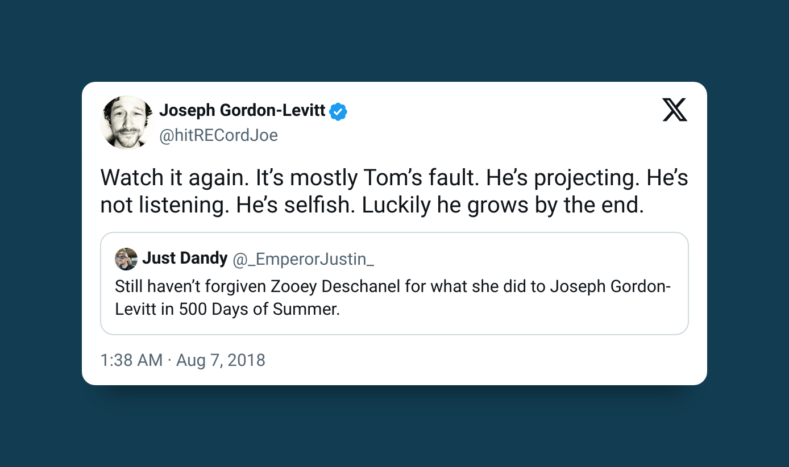

As I briefly mentioned on my [About page](/about), I occasionally share non-technical thoughts here—and this post is one of them. Today, I want to talk about a few powerful relationship lessons I learned from the movie `500 Days of Summer`.

This 2009 romantic drama tells the story of Tom, a hopeless romantic who believes Summer is his soulmate. Despite their strong chemistry, Summer makes it clear she doesn't want anything serious. Eventually, she moves on and marries someone else—leaving Tom confused, heartbroken, and questioning what love really means.

After watching the movie at least three times and discussing it with others, I've gathered several key takeaways—especially for men looking for a serious, committed relationship. If you've ever found yourself in a situation like Tom's, these lessons might save you some heartache.

## Lower your expectations early

Just because you click with someone or share similar interests doesn't automatically mean she's “the one.” Sometimes, two people can have romantic chemistry without being right for each other long-term. Learn to recognize the difference before you get too invested.

## Listen to what she wants

If she says she's not looking for anything serious, believe her.

You can ask about her future goals, but if her timeline or expectations don't align with yours, it's better to walk away. For example, if you're 25 and want to get married by 29, but she's thinking about settling down in her 30s, the mismatch could lead to frustration and wasted time.

Don't try to change her mind. Instead, find someone whose values and vision align with yours.

## Don't misread affection as commitment

Just because she texts you first, compliments you, goes on dates, or shows playful affection doesn't mean she sees you as more than a friend or casual companion.

Some people are naturally warm or flirtatious without intending anything serious. Pay attention to patterns—especially how she treats others—and don't mistake comfort for commitment.

If she enjoys your company but explicitly says she's not interested in a relationship, circle back to lesson #2.

## Make room for disappointment

Not every connection will turn into a lasting relationship—and that's okay.

It’s important to be emotionally prepared for the possibility that she might not be "the one." It’ll sting, but letting go is better than forcing something that's not meant to be. Trust that better-aligned opportunities will come your way.

## Don’t blame it all on her

Actor Joseph Gordon-Levitt, who played Tom, once said that the real issue wasn't Summer—it was Tom's unrealistic expectations.

If a relationship doesn't work out, take a step back and reflect: Did you ignore red flags? Were you honest with yourself about what she wanted? Sometimes, the disappointment we feel is a result of the story we told ourselves—not what actually happened.

### Final Thoughts

`500 Days of Summer` isn't just a love story. It's a cautionary tale about projection, miscommunication, and self-growth. If you're someone who values deep, committed relationships, these lessons can help you navigate the dating world with a clearer head and a stronger heart.
