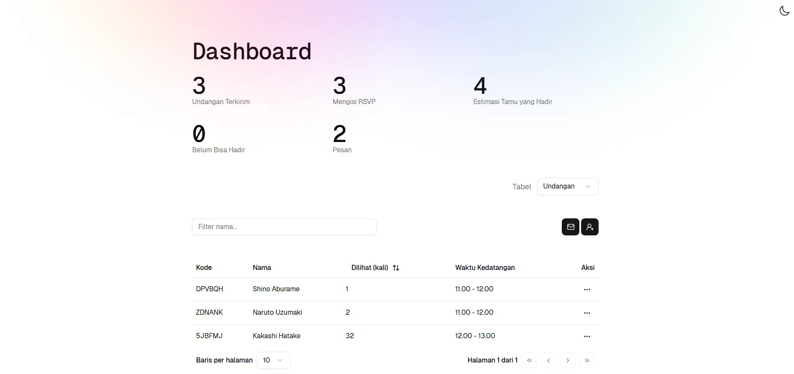
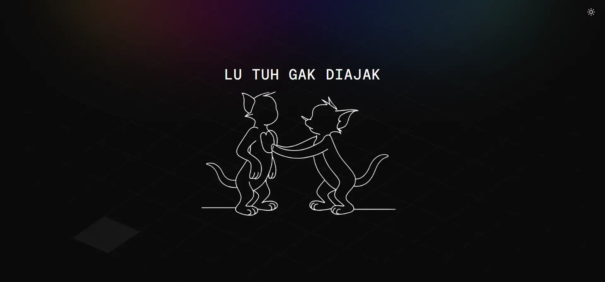

I'm excited to release a new, rebuilt-from-scratch version of my digital wedding invitation project. While my previous [folklore-invitation](./folklore-invitation) project still works, its design felt outdated. Armed with better visual references, I decided a complete rebuild was the best path forward.

The result is a new, publicly available template on GitHub. This new version isn't just a visual upgrade. It features a much cleaner codebase and better organization. It's designed for anyone to easily clone, customize, and deploy their own digital invitation system without starting from zero.

Just like most of my recent personal projects, this one is built with Astro, React, Tailwind, and Supabase. It’s a stack I’ve gotten comfortable with for building both frontend and backend features.

## Core Features and System Flow

The system flow is designed to be simple and intuitive for both the admin and the guests.

### Admin Dashboard

 A secure admin dashboard allows you to manage the entire event. From here, you can:

- **Create & Edit Invitations:** Set all the event details, couple's info, and text that will be displayed to guests.
- **Manage Guests:** Invite new guests, which automatically generates a unique 6-digit code and a personalized link for each one.
- **Track RSVPs:** See at a glance who has confirmed their attendance.
- **View Wishes:** Read all the well-wishes and messages submitted by guests.

### The Guest Experience

The guest flow is seamless and personalized:

- **Unique Links:** The admin sends the personalized link directly to the guest. When opened, the guest is taken straight to their invitation, with their name displayed.
- **Manual Code Entry:** If a guest lands on the homepage without a link, they can manually enter their 6-digit code to access their invitation.
- **404 Redirect:** Invalid codes will redirect to a [404 page](https://wedding-mbediding.netlify.app/not-found) as seen below in dark mode.

### Invitation Page Layout

The page itself maintains a minimal and consistent aesthetic. It includes all the essential sections:

- The couple
- Event details (with maps)
- Countdown timer
- RSVP form
- Guest wishes
- Closing

## Get the Template

While the previous version is still public, this new project is specifically intended to be a starting point and a public [template](https://github.com/rayhannr/wedding-mbediding). I wanted to build something practical not just for myself, but for anyone who needs a simple, clean, and modern wedding invitation setup.
