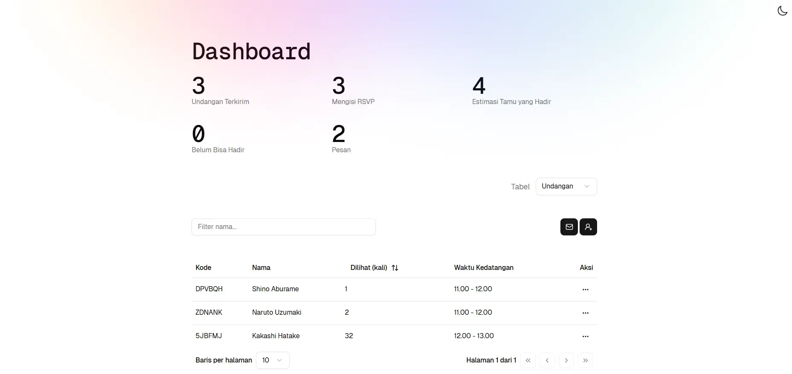
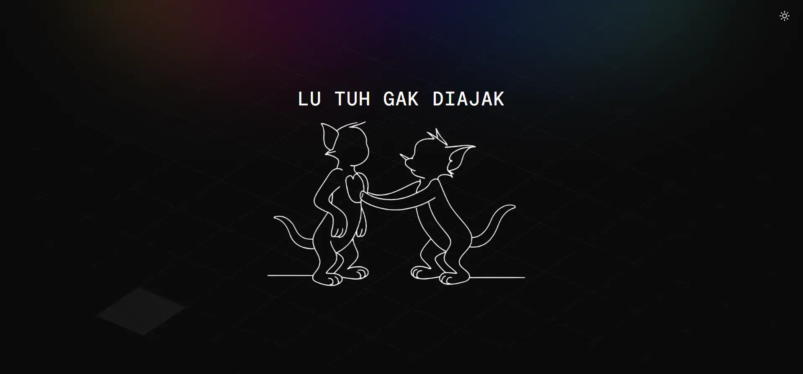

Back in 2023, I built [folklore-invitation](./folklore-invitation) as a wedding invitation template. It still works, but I was never fully happy with how it looked. The design was too plain, and it used MongoDB because that's what a Udemy backend course taught me at the time. MongoDB Atlas, their own managed cloud service, has a free tier that made deployment straightforward for a first fullstack project. Once I started using Supabase and realized how accessible SQL-based options had become, there wasn't a good reason to reach for MongoDB here anymore.

So when my own wedding came around, I took it as a chance to build something better: a cleaner design, a modernized stack, and a version other people could actually pick up and use.

## How it works

Built with Astro, React, Tailwind, and Supabase. Staying on a familiar stack let me put the effort into the design and the system itself rather than infrastructure decisions. Supabase also comes with built-in authentication, so the admin dashboard didn't require building a separate auth service from scratch.

For illustrations, I kept the same line-art style as the previous project, but generated them with Gemini this time. AI image generation has improved enough since 2023 that it was a viable option. I did try colored hand-drawn and 3D illustrations, which are common on modern sites, but the results weren't good enough to use. Line art was more forgiving to iterate on. Even so, getting the right output took multiple sessions of refining prompts. Without a design background it's hard to articulate exactly what you want, which slows the whole process down.

The system is split into two parts: an admin dashboard and the guest-facing invitation.

### Admin dashboard

The admin side covers everything the couple needs to manage the event. You configure the invitation details, add guests individually, and each one automatically gets a unique 6-character code and a personalized link. There's also a view for tracking RSVPs and reading submitted wishes. Keeping it self-contained means the couple doesn't need to touch any code after the initial setup.

### Guest flow

Most digital invitations put the guest's name in a query parameter, which means anyone can modify the URL and the page loads as if they were actually invited. This project works differently. Each guest's link contains their unique code. When opened, the page calls the backend to look up the guest's name by that code. If found, the invitation loads with the correct name from the database. If not, they get a 404.

The invitation page covers the couple, event details with maps, a countdown timer, RSVP form, guest wishes, and a closing section.

## From private wedding to public template

I used this for my actual wedding. On the guest side, things worked as expected: guests could submit wishes and RSVPs without issues, and there were no surprise behaviors like audio that plays on page load. After the wedding, I stripped out the private data and released it as a public [template on GitHub](https://github.com/rayhannr/wedding-mbediding).

The main thing this version adds over [folklore-invitation](./folklore-invitation) is the admin dashboard. The old one had no way to manage guests or track responses without going directly into the database. I don't know whether anyone has actually cloned the template since GitHub doesn't send notifications for that, but it's there if anyone needs a starting point.
